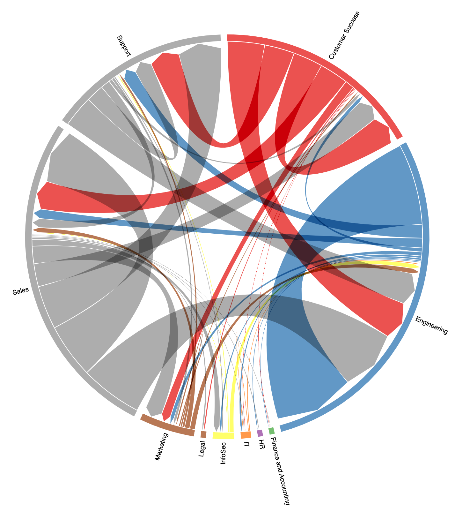

# Stack Internal Interactions

Create a chord diagram showing how departments interact through questions, answers, and comments in Stack Internal.

**Use [so4t_interactions.html](so4t_interactions.html).** It is the current browser version and uses **API v3 only**. Keep the `assets/` folder beside the HTML file so its bundled Stacks styles load. The Python scripts and `requirements.txt` remain in this repository for historical reference; they are not the recommended way to run the report and may still depend on API v2.

## Run the HTML version

1. Download this repository and open `so4t_interactions.html` in a modern browser, keeping `assets/` beside it. No Python installation, web server, or build step is needed.
2. Enter your Stack Internal site URL:
   - Enterprise: `https://your-site.stackenterprise.co` (or your custom Enterprise domain).
   - Business: `https://stackoverflowteams.com/c/your-team`.
3. Enter an API v3 bearer access token with read access to users, questions, answers, and comments. For Enterprise, follow your instance's API authentication guide at `https://your-site/api/docs/authentication`. For Business, use a personal access token with access to the team.
4. Optionally choose a question date range and department naming rules, then select **Build report**.
5. Explore the diagram and download the interaction matrix as CSV or the diagram as SVG.

The page requests the API directly from the browser. Your browser must be able to reach the Stack Internal site, and that site must allow browser requests from a local file. If the page reports a connection or cross-origin error, ask your Stack Internal administrator to check its API browser access settings. The page does not store your token, users, or report data; closing the tab clears them.

## How interactions are counted

The report uses API v3's paginated `/users` and `/questions` endpoints, then retrieves answers and comments through their API v3 endpoints. It counts a connection from the author of a question or answer to a responding department. Several responses from one department on the same question or answer count once. The question author commenting on an answer is not counted again. Activity within one department is excluded from the diagram. Responses from users without a known department cannot be assigned to a connection; their count appears below the report.

The report reads department values from the API's user records. Populate the Department attribute in your SAML or user provisioning configuration to make the diagram useful. You can optionally:

- Upload a CSV with `old_team_name,new_team_name` columns to rename or combine departments. See [the template](Templates/team_rename.csv).
- Remove trailing numbers from department names, such as `Eng2.1` → `Eng`. This option is unavailable when a rename CSV is supplied.
- Restrict questions to a date range for a faster, narrower report.

Large sites can take time because API v3 returns answers and comments separately. The page shows progress and obeys API throttling responses. All requests are read-only.

## Historical Python files

`so4t_interactions.py`, `so4t_api_v2.py`, `so4t_api_v3.py`, and `so4t_request_validate.py` are preserved for reference. They are not maintained as the current tool; `so4t_interactions.py` still calls API v2. Use the standalone HTML page above for new reports.

## Support

If you encounter a problem, open a GitHub issue with the browser and the error message shown by the page. Do not include your access token or private site data. This project is provided as-is under [LICENSE](LICENSE).
